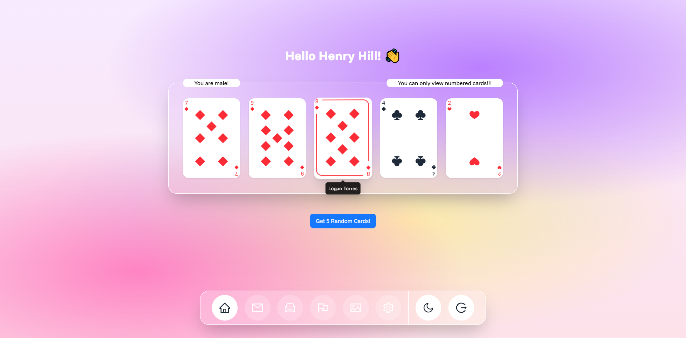

# 📌 راه‌اندازی پروژه React + Vite

## 🚀 مراحل اجرا

1. ریپازیتوری را کلون کنید:
2. وارد پوشه پروژه شوید:
3. پکیج‌ها را نصب کنید:
nodejs را نصب داشته باشید
dns خود را نیز تغییر دهید

   ```bash
   npm install
   ```
4. پروژه را اجرا کنید:

   ```bash
   npm run dev
   ```
5. در مرورگر آدرس زیر را باز کنید:

   ```
   http://localhost:5173
   ```

---

## 📝 توضیحات پروژه

* این طرح به‌صورت ذهنی پیاده‌سازی شده؛ به چیزی خاصی نگاه نکردم و فقط در ذهنم تصور کردم و کدنویسی کردم.

* چون حوصله نداشتم از روی عکس اندازه‌ها، آیکن‌ها، رنگ‌ها و جزئیات دیگر را دربیاورم.

* اگر به استایل اهمیت می‌دهید، لطفاً طرح فیگما ارسال کنید.

* APIهای استفاده‌شده مربوط به سایت [DummyJSON](https://dummyjson.com) هستند و صرفاً از **لاگین** و **لیست کاربران** استفاده شده است.

---

## 🔐 صفحه لاگین

* در این صفحه لیست کاربران نمایش داده می‌شود.
* کافی است یک `username` و `password` انتخاب کنید و وارد شوید.

📸 تصویر نمونه:


---

## 📊 صفحه داشبورد

* راستش دقیقاً متوجه نشدم منظور شما از «کارت» چیست. برای همین از کارت‌های پاسور استفاده کردم 😂

* از آنجایی که endpointها نقش کاربری ندارند، من جنسیت را بررسی می‌کنم:

  * اگر کاربر **مرد** باشد → فقط کارت‌های شماره‌دار نمایش داده می‌شوند.
  * اگر کاربر **زن** باشد → فقط کارت‌های تصویری (آس، شاه، بی‌بی و سرباز) نمایش داده می‌شوند.

* در پشت صحنه، لیست کاربران دریافت می‌شود و به‌صورت تصادفی پنج کاربر انتخاب می‌شوند.

* اگر ماوس را روی هر کارت نگه دارید، **نام و نام خانوادگی کاربر** نمایش داده می‌شود.

📸 تصویر نمونه:


---

## ⚠️ نکات

* در این پروژه خیلی چیزها در نظر گرفته نشده است.
* ساختار پروژه برای بزرگ‌تر شدن مناسب نیست.
* بسیاری از تنظیمات و کانفیگ‌ها هم انجام نشده‌اند.
